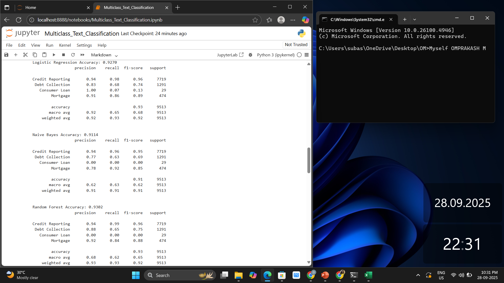
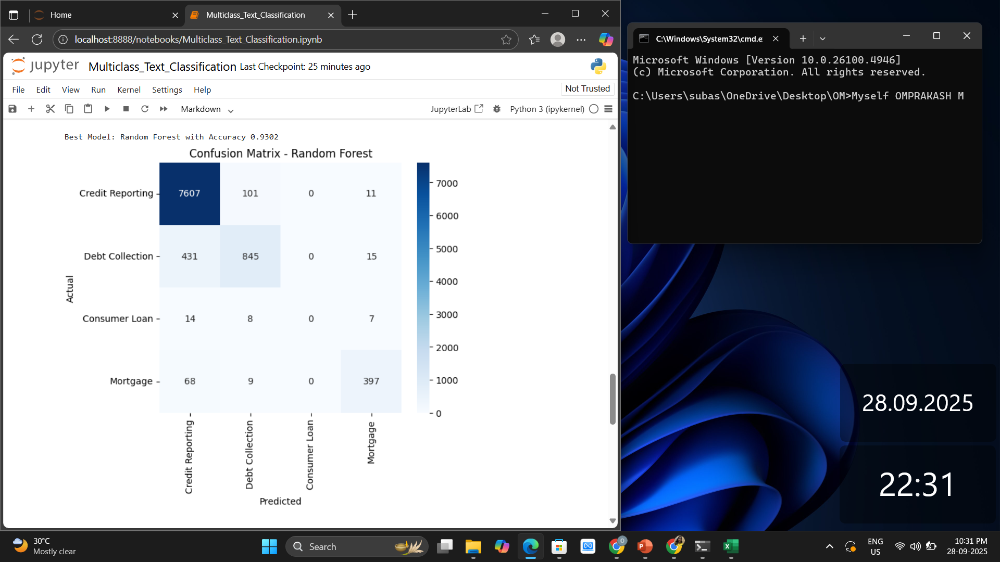
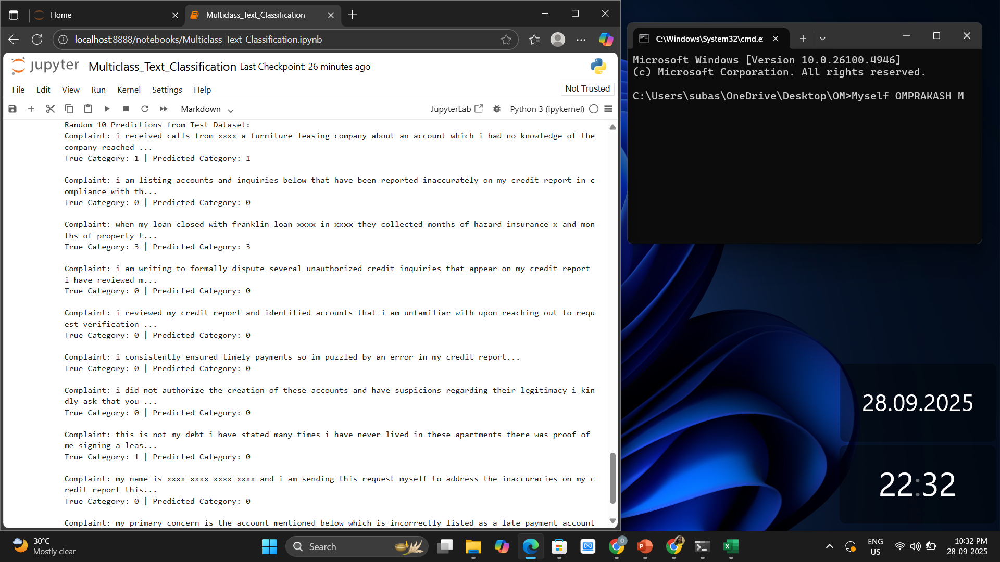

# Task 5 - Consumer Complaint Text Classification

## 📌 Overview
This project performs **multi-class text classification** on the [Consumer Complaint Dataset](https://catalog.data.gov/dataset/consumer-complaint-database).  
Complaints are categorized into the following classes:

- `0` → Credit reporting, repair, or other  
- `1` → Debt collection  
- `2` → Consumer Loan  
- `3` → Mortgage  

The task includes **EDA, preprocessing, TF-IDF vectorization, model training, evaluation, and prediction**.

---

## 📂 Dataset
- Source: [Consumer Complaint Database](https://catalog.data.gov/dataset/consumer-complaint-database)  
- Columns used:
  - **Consumer complaint narrative** → Input feature (complaint text)  
  - **Product** → Target label (mapped into 0–3 categories)  

---

## ⚙️ Setup Instructions
Clone this repository and install required libraries:

```bash
git clone <your-repo-url>
cd <repo-folder>
pip install -r requirements.txt
```

Run the notebook in Jupyter:

```bash
jupyter notebook Multiclass_Text_Classification.ipynb
```

---

## ▶️ Steps Performed
1. **EDA** → Checked nulls, selected relevant columns, observed class imbalance.  
2. **Text Preprocessing** → Lowercasing, removing numbers/punctuation, stopwords.  
3. **Vectorization** → TF-IDF (max_features=3000).  
4. **Model Training** → Logistic Regression, Naive Bayes, Random Forest.  
5. **Model Evaluation** → Accuracy, precision, recall, f1-score, confusion matrix.  
6. **Predictions** → Made on random samples from the test dataset.  

---

## 📊 Results
- **Logistic Regression Accuracy:** 0.9270  
- **Naive Bayes Accuracy:** 0.9114  
- **Random Forest Accuracy:** 0.9302 ✅ (Best Model)  

---

## 📸 Screenshots (with Date/Name as per requirements)

### 1. Model Training & Accuracy Results


### 2. Confusion Matrix of Best Model (Random Forest)


### 3. Random Predictions from Test Dataset


---

## 🔍 Sample Predictions (from test set)
| Complaint (truncated) | True Label | Predicted Label |
|------------------------|------------|-----------------|
| "i received calls from xxxx a furniture leasing company..." | 1 (Debt Collection) | 1 (Debt Collection) |
| "i am listing accounts and inquiries below that have been reported inaccurately..." | 0 (Credit Reporting) | 0 (Credit Reporting) |
| "when my loan closed with franklin loan xxxx they collected months of hazard insurance..." | 3 (Mortgage) | 3 (Mortgage) |
| "i am writing to formally dispute several unauthorized credit inquiries..." | 0 (Credit Reporting) | 0 (Credit Reporting) |

---

## 🎥 Demo (Optional)
If required, a short video demo can be recorded showing:  
- Notebook execution  
- Screenshots with date/name  
- Model outputs  

---

## ✅ Submission Notes
- Code is in `Multiclass_Text_Classification.ipynb`.  
- Screenshots with **date/time + candidate name** are attached (`accuracies.png`, `confusion matrix.png`, `sample output.png`).  
- All steps from EDA → Prediction have been covered as per assignment rules.  
